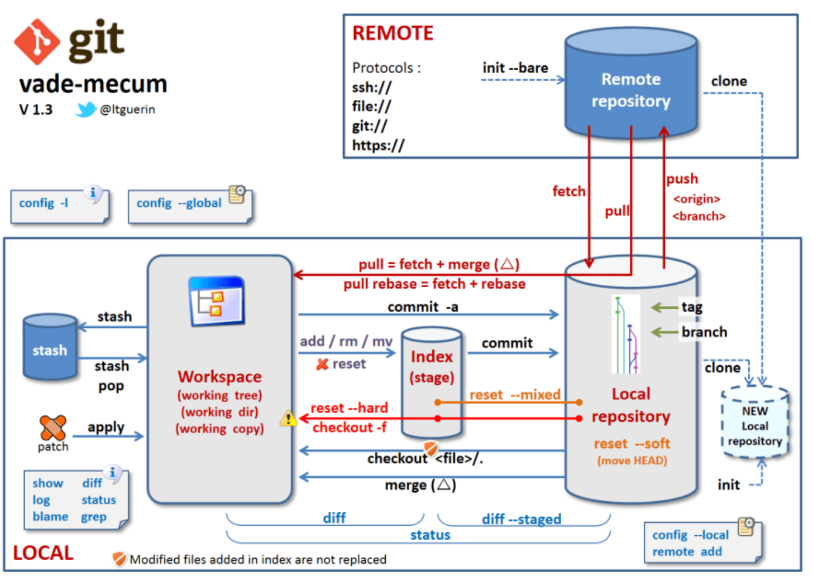
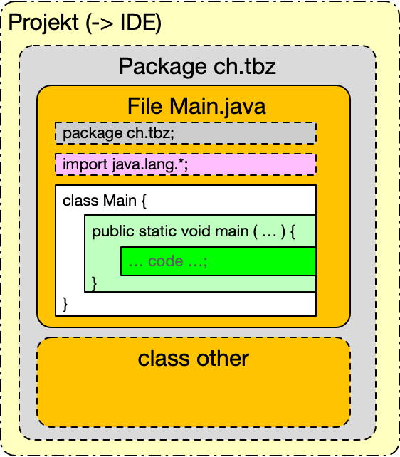
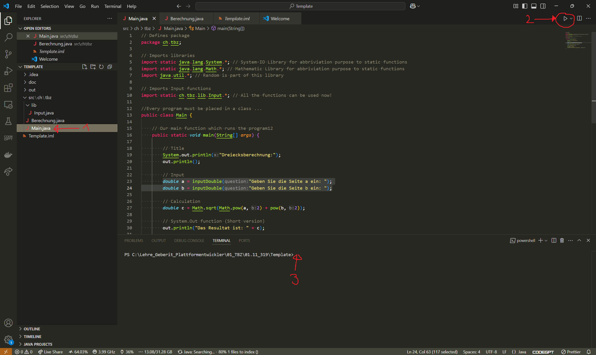
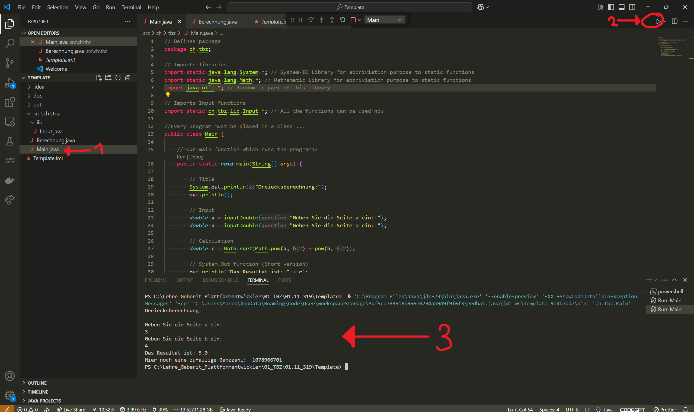
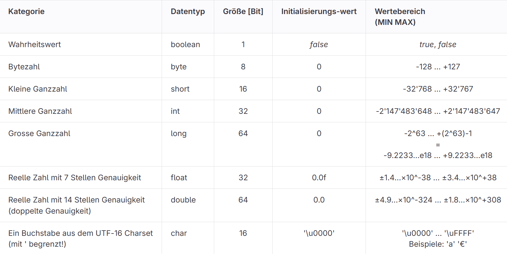

# Modul 319

## Lernportfolio

### Tag 1: Einführung in Java

#### Datum: 21. Februar 2025

Heute hat das Modul 319 begonnen, in dem wir uns mit Java beschäftigen. Zuerst erhielten wir eine Einführung in die Sprache und ihre grundlegenden Konzepte. Mit Hilfe des Miro-Boards visualisierten wir zentrale Begriffe und Strukturen von Java, was uns half, ein erstes Verständnis für die Sprache zu entwickeln.

Nach der theoretischen Einführung starteten wir mit der SOL-Aufgabe, um erste Programme in Java zu schreiben. So konnten wir die erlernten Grundlagen direkt anwenden und ein Gefühl für die SPrache bekommen. Zusätzlich haben wir unser Lernportfolio und das Nachweisportfolio auf GitHub erstellt und begonnen damit zu arbeiten. Dies dient dazu, unsere Fortschritte zu dokumentieren und unsere Arbeit strukturiert festzuhalten.

Besonders hilfreich fand ich die Arbeit mit Miro, da man so einen guten Überblick über die wichtigsten Java-Konzepte bekommt. Die SOL-Aufgabe und die Arbeit mit GitHub haben mir einen praktischen Einstieg in Java und Versionsverwaltung gegeben. Insgesamt war der Tag gut strukturiert und ich freue mich darauf, mein Wissen weiter zu vertiefen.

#### Aufgaben

##### Aufgabe SOL

**Was ist ein Tandem?**

Ein Tandem ist eine Gruppe. (In unserem Fall ist es eine Zweiergruppe)

**Aus welchen Kompetenzen bildet sich die Handlungskompetenz?**

Handlungskompetenz setzt sich aus Fach-, Methoden-, Sozial- und Selbstkompetenz zusammen.

**Was ist der Unterschied zwischen einem Lern- und einem Nachweis-Portfolio?**

Ein Lernportfolio dokumentiert den Lernprozess, während ein Nachweisportfolio abgeschlossene Arbeiten als Leistungsnachweis enthält.

**Was ist ein Beleg und wozu wird er verwendet?**

Ein Beleg ist ein schriftlicher oder digitaler Nachweis für eine erbrachte Leistung.

**Wann ist ein Nachweis abgenommen?**

Ein Nachweis ist abgenommen, wenn er geprüft und als vollständig anerkannt wurde.

**Welche Regeln gelten im Schulzimmer?**

Im Schulzimmer gelten Regeln wie Pünktlichkeit, respektvoller Umgang und sorgfältiger Umgang mit Materialien.

### Tag 2: GitHub, Java und IDE-Nutzung

#### Datum: 28. Februar 2025

Heute war der zweite Tag im Modul 319, und wir haben uns weiter mit Java beschäftigt. Der Fokus lag dabei auf der Arbeit mit GitHub und der Nutzung einer IDE (Integrated Development Environment).

Wir haben unser GitHub-Repo weiter bearbeitet und dabei erste Schritte mit der Versionskontrolle gemacht. Wir haben gelernt, wie man Dateien hinzufügt, ändert und diese Änderungen in GitHub speichert. Das hat uns geholfen, den Umgang mit Versionsverwaltung und das Dokumentieren unserer Fortschritte zu vertiefen.

Zusätzlich haben wir in der IDE weiter an unseren Java-Programmen gearbeitet und erste einfache Code-Snippets geschrieben. Das Arbeiten mit der IDE hat uns ermöglicht, schneller Fehler zu finden und unseren Code zu verbessern. Der Tag war insgesamt gut strukturiert, und ich konnte viele neue Dinge lernen.

#### Aufgaben

##### Aufgabe GitLAB

**Was macht ein Versionskontrollsystem?**

Ein Versionskontrollsystem wie Git speichert und verfolgt Änderungen am Code. Es ermöglicht Entwicklern, frühere Versionen wiederherzustellen, Fehler rückgängig zu machen und effizient im Team zusammenzuarbeiten.

**Welche GIT Server kennen Sie?**

GitHub, GitLab und Bitbucket sind bekannte Git-Server, die Entwicklern ermöglichen, Code zu verwalten, zu versionieren und gemeinsam daran zu arbeiten.

**Was braucht es auf dem lokalen Rechner, um ein GIT-Repo zu unterhalten?**

Du brauchst einen GitLab-Account, einen Code-Editor und GitBash, um den SSH-Link auf deinem Rechner zu klonen.

**Das Konzept von Git verstehen (Screenccast ab Position 6:38)**

Ein Git-Account speichert Repositories auf Plattformen wie GitHub oder GitLab. Mit einem lokalen Tool holst du Kopien der Repositories, markierst geänderte Dateien und speicherst sie im lokalen Repository. Danach kannst du die Änderungen wieder auf den Server hochladen.

**Zwei Möglichkeiten, GIT-Kommandos auszuführen?**

Man kann Git entweder direkt über die Kommandozeile oder mit GUI-Tools wie GitHub Desktop nutzen.

**Bedienung und Funktionsweise von GitHUB-Desktop**

Im Git-Tool zeigt der History Tab alte Versionen und der Changes Tab aktuelle Änderungen. Geänderte Dateien können zur Stage hinzugefügt werden, wobei rote Zeilen gelöscht und grüne Zeilen hinzugefügt wurden. Mit fetch und push werden Daten vom Remote-Repo abgeholt oder hochgeladen. Der Branch sollte „main“ oder „master“ sein.

**Kann Gitlab-Seite auf Englisch anzeigen lassen.**

Ja man kann GItLab-Seiten auf Englisch angezeigt lassen dies sind die möglihckeiten bei den verschieden Browser.

Google Chrome: Ein Übersetzungs-Prompt erscheint automatisch. Klicke auf "English" oder rechtsklicke und wähle "Translate to English".

Mozilla Firefox: Installiere eine Übersetzungs-Erweiterung wie "To Google Translate", gehe zur Seite und nutze die Erweiterung, um zu übersetzen.

Microsoft Edge: Der Übersetzungs-Prompt erscheint automatisch. Klicke auf "Translate" oder rechtsklicke und wähle "Translate to English".

Safari (macOS): Klicke auf den "Translate"-Button in der Adressleiste und wähle Englisch.

##### Aufgabe JAVA IDE

**Wozu wird eine IDE verwendet?**

Eine IDE wird verwendet, um den Entwicklungsprozess zu erleichtern, indem sie Tools wie Code-Editor, Compiler und Debugger integriert.

**Welches ist die neueste Version der Java JDK?**

Die neueste Version der Java JDK ist JDK 23.

**Die JDK besteht aus einigen Programmen. Nenne die zwei wichtigsten Programme, um ein eigenes Programm entwickeln zu können.**

Die zwei wichtigsten Programme in der JDK sind javac (Compiler) und java (Interpreter).

**Auf welchen Plattformen läuft JAVA?**

Java läuft auf Windows, macOS, Linux und anderen Unix-basierten Systemen.

**Erstes Programm in JAVA zum Laufen gebracht. (→ Einführung in das IDEA-Tutorial: "Hello IDEA" Min 2.00)**

Du hast ein einfaches "test_java"-Programm in Java ausgeführt

**Nur für APIs und Profis: Mein erstes JAVA Programm (Projekt) in mein Git-Repo (Server) hochgeladen.**

Du hast dein erstes Java-Projekt in ein Git-Repository auf einem Server hochgeladen.

### Tag 3: Variablen, Gültigkeitsbereiche und Programmstruktur

#### Datum: 07. März 2025

Heute habe ich mich intensiv mit den Grundlagen von Java beschäftigt und verschiedene wichtige Konzepte kennengelernt. Der Fokus lag dabei auf Variablen, Konstanten und dem Gültigkeitsbereich in einem Java-Programm.

Ich habe gelernt, wie Variablen deklariert, initialisiert und verwendet werden. Zudem wurde der Unterschied zwischen lokalen und globalen Variablen behandelt und wann eine globale Variable durch eine lokale überdeckt wird. Besonders wichtig war das Verständnis, dass globale Variablen ausserhalb von Methoden definiert werden und in der gesamten Klasse genutzt werden können, während lokale Variablen nur innerhalb ihres jeweiligen Blocks gültig sind.

Zusätzlich habe ich mich mit grundlegenden Operatoren, Ausdrücken und Literalen in Java auseinandergesetzt. Diese Konzepte sind essenziell für die Erstellung von Berechnungen und die Verarbeitung von Benutzereingaben im Programm. Ein weiteres Thema war die Struktur eines Java-Programms und der Ablauf von der Quellcode-Erstellung bis zur Ausführung.

Der Tag war lehrreich, und ich konnte viele wichtige Grundlagen festigen, die für das weitere Programmieren in Java notwendig sind.

#### Aufgaben

##### Aufgabe JAVA Basics

**Sie kennen den Weg vom Quelltext zum Output in der JAVA-Welt.**

Ein Quellcode wird grundsätzlich entweder "kompiliert" oder "interpretiert"
Zuerst wird es in der Entwicklungszeit das Programm entwickelt. Danach wird der Gesammte Code bei der Laufzeit ausgeführt.

**Sie kennen die (drei) grundsätzlichen Konzepte der Programmerstellung (Übersetzung).**

Die drei grundlegenden Konzepte der Programmerstellung sind Kompilierung, Interpretation und der Hybrid-Ansatz.

**Was ist ein "Ausdruck", ein "Literal", ein "Operator" und ein "Bezeichner".**

Ein Ausdruck ist eine Kombination aus Operanden und Operatoren, ein Literal ist ein fester Wert im Code, ein Operator führt eine Berechnung oder Operation aus, und ein Bezeichner ist der Name für Variablen, Methoden oder Klassen.

**Kenne den strukturellen Aufbau eines JAVA Programms.**

**Ein Projekt in der IDE mit "TBZ Template" eröffnet und ausgeführt.**

Ein Projekt wird in der IDE mit dem TBZ-Template erstellt, bearbeitet und anschliessend ausgeführt

**Kann ein einfaches Programm nachvollziehen.**

Ein einfaches Programm kann durch Lesen, Verstehen und Testen des Codes nachvollzogen werden.

**Kann mit eingegebenen Zahlen einfache Berechnungen kalkulieren.**

Mit dieser Anleitung kann man Berechnungen durchführen und, wie in diesem Fall, eine Hypothenuse herausfinden.

##### Aufgabe Variables Constants

**Konzept der Variabeln (Konstanten) ist bekannt.  >> Behälter mit Name, Datentyp, Grösse und (fixem) Inhalt.**

Variablen sind Speicherplätze mit Namen, Datentyp, Grösse und Wert. Konstanten haben einen festen Wert.

**Erkenne Deklarierung, Initialisierung und Verwendung von Variablen (Konstanten).**

Die Deklaration einer Variable bedeutet, dass ihr Name und ihr Datentyp festgelegt werden, jedoch noch kein Wert zugewiesen wird. Erst bei der Initialisierung erhält die Variable ihren ersten Wert, wodurch der entsprechende Speicherplatz belegt wird. Eine Variable kann anschliessend in verschiedenen Bereichen des Codes verwendet werden, beispielsweise in Berechnungen, Methoden oder zur Ausgabe von Werten.

**Kann den Gültigkeitbereich "setzen". (Position der Deklarierung im Code!).**

Der Gültigkeitsbereich einer Variable hängt von ihrer Deklaration ab. Lokale Variablen werden innerhalb einer Methode oder eines Blocks deklariert und sind nur dort gültig. Globale Variablen werden ausserhalb der Methoden, aber innerhalb einer Klasse deklariert und sind in der gesamten Klasse verwendbar.

**Wann wird eine "globale" Variable übderdeckt?**

Eine globale Variable wird überdeckt, wenn in einer Methode eine gleichnamige lokale Variable deklariert wird. In diesem Fall verwendet die Methode die lokale Variable, während die globale Variable ausserhalb der Methode unverändert bleibt.

### Tag 4: D1 und I1

#### Datum: 14. März 2025

Heute war ein intensiver Tag, der mit der Vorbereitung auf den D1-Test begann. Da ich beim ersten Versuch mit 15 von 24 Punkten leider nicht bestanden hatte, musste ich den Test noch einmal schreiben. Zwischen 9:00 und 10:30 Uhr habe ich intensiv gelernt, um mich für den zweiten Versuch besser vorzubereiten.

Nach der erneuten Prüfung konnte ich den Test schliesslich mit 20 von 24 Punkten bestehen, was für mich eine Erleichterung war. Der erste Versuch war knapp und ich war froh, dass ich mich durch das zusätzliche Lernen verbessern konnte.

Im Anschluss habe ich Donart bei der I1-Aufgabe unterstützt. Wir haben zusammen daran gearbeitet, und ich konnte ihm bei einigen schwierigen Aspekten helfen. Am Ende hat Donart die Aufgabe ebenfalls erfolgreich abgeschlossen.

Der Tag war sehr lehrreich und produktiv. Ich habe viel über meine eigenen Lernstrategien und die Zusammenarbeit mit anderen gelernt.

### Tag 5 (21.03.2025)

### Tag 6 (28.03.2025)

### Tag 7 (04.04.2025)
